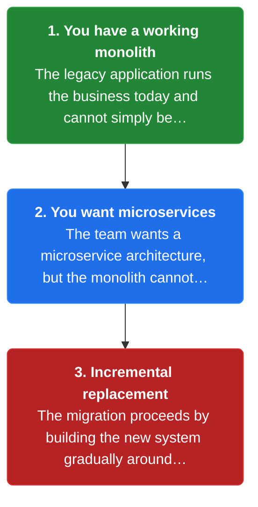
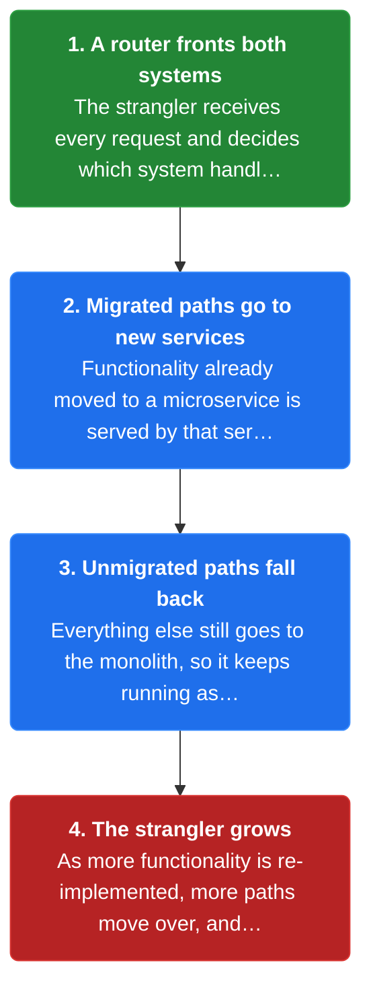
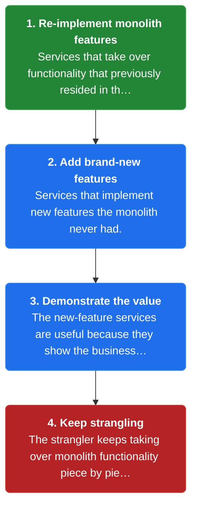

# Chapter 44: Strangler Application

> A strangler application that incrementally builds a new microservice-based system around a legacy monolith, routing work to the new system as it takes over functionality.

_Also known as: Chris Richardson · Microservice Patterns Ch. 44 · microservices.io /patterns/refactoring/strangler-application.html_

## Flow

### The migration problem

> **Why this matters:** You have a working legacy monolith and want a microservice architecture, but the monolith cannot be rebuilt in one step. The answer is to migrate incrementally, building the new system gradually around the old one.



1. **You have a working monolith** — The legacy application runs the business today and cannot simply be switched off.

2. **You want microservices** — The team wants a microservice architecture, but the monolith cannot be rebuilt in a single step.

3. **Incremental replacement** — The migration proceeds by building the new system gradually around the old one, one piece at a time.

```java
// MONOLITH SIDE — the strangler grows by moving one feature at a time out of the monolith
// PARTIES: MONO = legacy monolith · NEW = new strangler application · U1 = user
// STATE (before):
//    mono_features : { "catalog": true, "orders": true, "accounts": true }
//    new_features  : {}
// DEF: migrate · CALLED BY: the team for each feature, one at a time
// -> feature : "catalog"
//    step 1 · re-implement "catalog" as a microservice in NEW   // new_features : {} -> { "catalog": true }
//    step 2 · cut "catalog" traffic over to the new service   // mono_features.catalog : true -> false
//    step 3 · the monolith is left holding only the remaining features   // mono_features : { "catalog": true, "orders": true, "accounts": true } -> { "orders": true, "accounts": true }
// <- state : mono_features = { "orders": true, "accounts": true } · new_features = { "catalog": true } — one piece moved, not the whole monolith at once

```

### The strangler routes requests

> **Why this matters:** The strangler application fronts both the new services and the legacy monolith, deciding per request which system handles it. Functionality already migrated is served by a microservice; everything else still falls back to the monolith.



1. **A router fronts both systems** — The strangler receives every request and decides which system handles it.

2. **Migrated paths go to new services** — Functionality already moved to a microservice is served by that service.

3. **Unmigrated paths fall back** — Everything else still goes to the monolith, so it keeps running as before.

4. **The strangler grows** — As more functionality is re-implemented, more paths move over, and the monolith shrinks.

```java
// STRANGLER SIDE — one request is routed to a migrated microservice; an unmigrated path falls back to the monolith
// PARTIES: RTR = strangler router · NEW = new microservice · MONO = legacy monolith · U1 = user
// STATE (before):
//    route_table : { "/catalog": "NEW", "/orders": "MONO" }
// DEF: route · CALLED BY: RTR on each incoming request
// -> request : { "path": "/catalog" }
//    step 1 · look up "/catalog" in route_table   // matched : "" -> "NEW"   BECAUSE /catalog was already migrated
//    step 2 · forward the request to the matched backend   // target : "" -> "NEW"
//    step 3 · NEW serves the catalog from its own service
// <- response : "catalog items" from NEW — MONO never receives this request
//    alt path "/orders" : matched : "NEW" -> "MONO" · target : "" -> "MONO" — MONO still serves it, unchanged (fall back)

```

### Two kinds of service

> **Why this matters:** The strangler application consists of two types of services: ones that re-implement functionality that previously lived in the monolith, and ones that add brand-new features. The new-feature services are useful because they demonstrate the value of microservices to the business.



1. **Re-implement monolith features** — Services that take over functionality that previously resided in the monolith.

2. **Add brand-new features** — Services that implement new features the monolith never had.

3. **Demonstrate the value** — The new-feature services are useful because they show the business the value of using microservices.

4. **Keep strangling** — The strangler keeps taking over monolith functionality piece by piece until the legacy application is no longer needed.

```java
// STRANGLER SIDE — a brand-new feature lands in the new app, showing the business what microservices enable
// PARTIES: NEW = new strangler application · MONO = legacy monolith · RTR = strangler router · U1 = user
// STATE (before):
//    new_features : { "catalog": true }        // re-implemented monolith features
//    brand_new    : {}                          // features with no monolith twin
//    route_table  : { "/catalog": "NEW" }
// DEF: add_feature · CALLED BY: the team to add a feature the monolith never had
// -> feature : "recommendations"
//    step 1 · build "recommendations" as a new microservice   // brand_new : {} -> { "recommendations": true }
//    step 2 · register it in the router   // route_table : { "/catalog": "NEW" } -> { "/catalog": "NEW", "/recommendations": "NEW" }
//    step 3 · record it as owned by NEW   // new_features : { "catalog": true } -> { "catalog": true, "recommendations": true }
// <- state : NEW now serves { "catalog": true, "recommendations": true } — MONO never had a recommendations feature to cut over

```


## Key Concepts

### The Problem

**Migrating the monolith.** The question the pattern answers: how do you migrate a legacy monolithic application to a microservice architecture?


### The Solution

Modernize by incrementally developing a new (strangler) application around the legacy application; the strangler has a microservice architecture.


### Key Facts

| Fact | Detail | In the wild |
|---|---|---|
| Strangler application | Modernize by incrementally developing a new (strangler) application around the legacy application; the strangler has a microservice architecture. | A router that forwards migrated paths to new services and leaves the rest on the monolith. |
| Two systems to run | You pay for two systems side by side for as long as the migration takes. | A router that sends some paths to new services and the rest to the monolith during the same release. |
| Two kinds of service | You must manage both kinds: re-implementations and net-new features; the new-feature services are useful because they demonstrate microservices' value to the business. | A recommendations service that never existed in the monolith, shipped alongside a migrated catalog service. |


### Tradeoffs & When

- You pay for two systems side by side for as long as the migration takes.
- You must manage both kinds: re-implementations and net-new features; the new-feature services are useful because they demonstrate microservices' value to the business.


<details><summary>All concepts (index)</summary>

### Problem: Migrating the monolith

**Why.** A team wants microservices but starts with a working legacy monolith that cannot be replaced in one move.

**Claim.** The question the pattern answers: how do you migrate a legacy monolithic application to a microservice architecture?

**Grounding.** This is the pattern's problem statement, taken verbatim.

**In the wild.** A long-running monolith whose features are moved to services a few at a time.
### Solution: Strangler application

**Why.** You cannot replace the monolith in one step, so you need a way to build the new system gradually while the old one keeps running.

**Claim.** Modernize by incrementally developing a new (strangler) application around the legacy application; the strangler has a microservice architecture.

**Grounding.** This is the pattern's solution statement, which adds that the strangler consists of two types of services: re-implemented monolith functionality, and new features.

**In the wild.** A router that forwards migrated paths to new services and leaves the rest on the monolith.
### Tradeoff: Two systems to run

**Why.** During the migration the monolith and the strangler both run, and both must be operated and deployed.

**Claim.** You pay for two systems side by side for as long as the migration takes.

**Grounding.** The solution keeps the legacy application running while the strangler is built around it, so both are live at once.

**In the wild.** A router that sends some paths to new services and the rest to the monolith during the same release.
### Tradeoff: Two kinds of service

**Why.** The strangler mixes services that replace monolith functionality with services that add brand-new features.

**Claim.** You must manage both kinds: re-implementations and net-new features; the new-feature services are useful because they demonstrate microservices' value to the business.

**Grounding.** The reference names both types explicitly and calls the new-feature services particularly useful for showing business value.

**In the wild.** A recommendations service that never existed in the monolith, shipped alongside a migrated catalog service.

</details>


## Quiz

1. How does the strangler application migrate a monolith?

   - A. Rewrite the whole monolith in one release
   - B. Incrementally build a new application around the legacy application
   - C. Freeze the monolith and start over from scratch
   - D. Split the monolith's database into many databases first

<details><summary>Reveal answer</summary>

**B.** The solution is to modernize by incrementally developing a new (strangler) application around the legacy application. A, C and D are one-shot or wrong-order approaches the pattern does not prescribe.

</details>

2. What two types of services make up the strangler application?

   - A. Services that re-implement monolith functionality, and services that implement new features
   - B. Services that cache data, and services that log events
   - C. Services that authenticate users, and services that bill customers
   - D. Services that run on VMs, and services that run in containers

<details><summary>Reveal answer</summary>

**A.** The reference names exactly these two types: re-implementations of functionality that previously resided in the monolith, and services for new features. B, C and D are unrelated groupings.

</details>

3. Why are the new-feature services particularly useful?

   - A. They are faster to write than re-implementations
   - B. They demonstrate to the business the value of using microservices
   - C. They never need to talk to the monolith
   - D. They are the only services the router needs

<details><summary>Reveal answer</summary>

**B.** The reference says the new-feature services are particularly useful since they demonstrate to the business the value of using microservices. The other options are not stated.

</details>

4. A request arrives for a path the strangler has not yet migrated. What happens?

   - A. It is dropped
   - B. It falls back to the monolith
   - C. It is queued until the path is migrated
   - D. It is retried against every service

<details><summary>Reveal answer</summary>

**B.** The strangler routes migrated paths to the new services and leaves everything else on the monolith, so an unmigrated path falls back to the monolith. A, C and D describe behaviors the pattern does not have.

</details>

